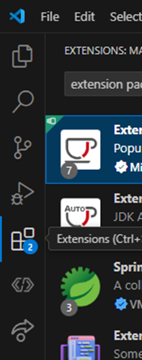

# 1.2: Install VSCode
VSCode is an IDE (Integrated development environment)  
  
It's like Microsoft Word, but for code  
VSCode is the only IDE supported by WPILib  
WPILib has a special version of VSCode  
- Includes extra tools for FRC teams  
Download here (or search “Install WPILib”): https://docs.wpilib.org/en/stable/docs/zero-to-robot/step-2/wpilib-setup.html  

Click on the “Extensions” button on the left side of the screen  

Install “Extension Pack for Java”  

This will help with testing Java code
You may need to reload window  
No need to install a JDK (already installed with WPILib VSCode)  
You can close out of the welcome screen  
